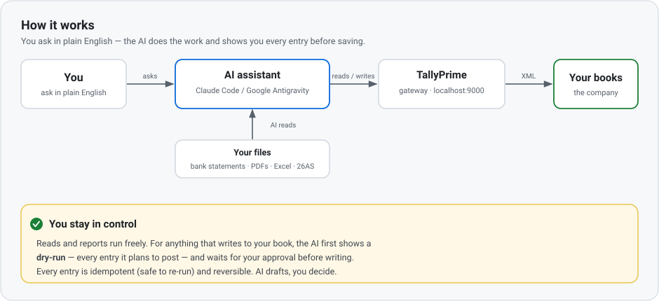

# Tally + AI Integration Toolkit

**In plain English:** talk to an AI assistant on your PC and it does your **TallyPrime** work for you —
data entry, bank reconciliation, and reports — reading your bank statements / PDFs / Excel, and **showing
you every entry before anything is saved**.



### 👋 New to this / not a techie? Read this box first
- **How you use it:** you type requests in **plain English** — *"reconcile ICICI for FY25-26"*, *"post these
  dividends"*, *"show me a P&L"*. The AI reads your files and does the work.
- **You stay in control:** nothing is written to Tally without your **review and approval** — the AI drafts, you decide.
- **You do NOT type the `python …` / `curl …` commands** you'll see in these docs. Those are what the *AI*
  runs for you (or a developer). Your job is to **ask, check, approve.**
- **Where to start:** ① [`ENVIRONMENT.md`](./ENVIRONMENT.md) — set up your PC (zero coding) → ② the
  [`sample/`](./sample/) **practice company** (safe throwaway) → ③ then point it at a real book.
- **What do I actually say to it?** copy-paste starter prompts in [`PROMPTS.md`](./PROMPTS.md).
- **Unfamiliar words?** see the [Glossary](./ENVIRONMENT.md#glossary-plain-english).

<details><summary><b>The technical one-liner</b> (for developers / practitioners)</summary>

A portable, **company-agnostic** toolkit for reading and writing a local **TallyPrime** company over its
built-in **HTTP-XML gateway**, so an accountant + AI assistant can do bulk data entry, reconciliation and
reporting **safely** on live books. Per real client, create a **conventions file** from
[`conventions-template.md`](./conventions-template.md) — that's what lets the AI post entries
indistinguishable from the owner's own.
</details>

## See it in action

Here's what the whole thing actually *looks like* — you type in plain English, the AI does the work and
**shows you before saving** (this uses the throwaway [`sample/`](./sample/) company, so it's safe to copy):

```text
You:  Reconcile "Practice Bank" for FY25-26 against sample/statement_2526.csv —
      show me only the mismatched dates.

AI:   Pulled 41 vouchers + the statement. Comparing by net daily movement…
      3 dates don't match, net gap −53,200:
        05-Jul-2025   book 0        statement −12,000    (statement-only — not in Tally)
        18-Sep-2025   book −8,000   statement −49,200    (₹41,200 short in the book)
        22-Feb-2026   book +6,000   statement 0          (in book, not on statement)
      Want me to draft the two missing entries for your review?

You:  Yes, draft them — don't post yet.

AI:   Draft (dry-run, nothing saved):
        1) 05-Jul-2025  Payment  Practice Bank → Courier Charges   12,000
        2) 18-Sep-2025  Payment  Practice Bank → Vendor XYZ        41,200
      Both balance. Say "post" to write them (each gets a REMOTEID, re-runnable/reversible).

You:  post

AI:   Posted 2 vouchers (created, no exceptions). Re-reading the ledger…
      Practice Bank now ties to the statement to the rupee. ✅
```

Reads and reports are always safe to run; **writes only happen after you approve.** More ready-to-paste
prompts in [`PROMPTS.md`](./PROMPTS.md).

## Start here
1. [`ENVIRONMENT.md`](./ENVIRONMENT.md) — **new to this?** Install the AI assistant, Python & Tally (zero coding assumed).
2. [`SETUP.md`](./SETUP.md) — enable the gateway & confirm connectivity (5 min).
3. [`sample/`](./sample/) — a **throwaway practice company** with realistic, deliberately-flawed data + graded exercises.
4. [`tally-general-guide.md`](./tally-general-guide.md) + [`quirks.md`](./quirks.md) — the mechanics & traps.
5. Copy [`conventions-template.md`](./conventions-template.md) per real client.

## Contents

| File | What it covers |
|---|---|
| [`ENVIRONMENT.md`](./ENVIRONMENT.md) | Getting started for accountants (zero coding): install the AI assistant (Antigravity/Claude Code + the 🇮🇳 free-Gemini-via-Jio route), turn on auto/agent mode, Python, Tally; what the AI reads natively; using it on a real book; plain-English glossary. |
| [`PROMPTS.md`](./PROMPTS.md) | Copy-paste plain-English prompts for common jobs (reconcile a bank, post dividends, run a P&L, check TDS vs 26AS, year-end journals). |
| [`SETUP.md`](./SETUP.md) | Enable the Tally HTTP-XML gateway, licence check, first connectivity test, Python deps. |
| [`tally-general-guide.md`](./tally-general-guide.md) | Gateway mechanics: reading (Voucher Register / Trial Balance / P&L / collections), data structures, writing (voucher Import), safety checklist. |
| [`quirks.md`](./quirks.md) | 38 non-obvious traps (gateway, reading, writing, gap-analysis, source files, TDS-from-26AS, capital gains). Saves you re-discovering them. |
| [`conventions-template.md`](./conventions-template.md) | **Blank template** for a per-company playbook (chart of accounts, posting recipes, narration/sign conventions, gap-analysis workflow). |
| [`examples/`](./examples/) | 13 copy-paste XML templates: list companies, read ledgers/day-book, export Trial Balance & P&L, import Receipt/Payment/Contra/Journal/Purchase, create ledger/stock-item, delete voucher. |
| [`scripts/`](./scripts/) | `tally_io.py` — config-driven helpers: export reports, idempotent voucher import (REMOTEID), journals, delete, safe workflow. **`tally_report.py`** — cached SQL reporting: pull a date range once into SQLite, run ready-made reports (trial-balance, group-summary, stock, ledger, TDS…) or ad-hoc `--sql`, refresh by timeframe; add a report by dropping a `.sql` file. **`import_sheet.py`** — a reviewed Excel/CSV → vouchers (dry-run, then `--post`; idempotent). **`pdf_extract.py`** — dump text/tables from (password-protected) PDFs to feed that sheet. **`capital_gains.py`** — split equity sales into STCG §111A / LTCG §112A with 31-Jan-2018 grandfathering. |
| [`sample/`](./sample/) | Practice sandbox: **two years** — a *correct* FY24-25 reference year (multi-bank, sales/purchase, **GST**, **TDS**, **loans**) and a *flawed* FY25-26 practice year (opens from carry-forward) with **5 planted issues** + a mismatching bank-statement CSV. Includes **Lesson 0** (post vouchers from an Excel, bank lines from a PDF), a **TDS-from-26AS** lesson, a **capital-gains** lesson (AIS↔broker → STCG/LTCG split with grandfathering), an 8-step exercise set, and an [answer key](./sample/ANSWERS.md). Load via seed script, XML import, or a restored Tally backup. |
| `requirements.txt`, `requirements-optional.txt`, `LICENSE` | Core Python deps; optional OCR/PDF power tools; MIT licence. |
| [`CHANGELOG.md`](./CHANGELOG.md) · [`CONTRIBUTING.md`](./CONTRIBUTING.md) · [`SECURITY.md`](./SECURITY.md) | Release notes; how to raise issues / PRs; data-privacy & security policy. |

## 30-second orientation (for developers — non-techies can skip this)

- Endpoint: `http://localhost:9000` — POST XML, `Content-Type: text/xml`.
- Send requests with: `curl.exe -s -X POST -H "Content-Type: text/xml" --data-binary @file.xml http://localhost:9000`
- Company string must match the loaded company **verbatim**.
- **Never** read/modify the binary files under `…\TallyPrime\data\<companyId>\` — use the gateway only.

## The golden rules before writing anything

1. **Back up in-app** (Gateway of Tally → F3/Alt-Y → Backup).
2. **Ensure the licence is active** (not "Educational mode" — see quirks #2/#2a; Educational mode rejects any
   voucher not dated on the 1st/2nd/last day of a month).
3. **Gap-analyse first** — owners enter data manually & partially; query what already exists and import only
   the missing items. **Compare by net daily movement, not just per-line** (owners consolidate same-day
   entries — matching line-by-line double-counts). Tally does NOT dedupe.
4. **One `<TALLYMESSAGE>` per voucher** on import, with an explicit **`REMOTEID`** (idempotent + reversible).
5. **Show the XML, test small, read back, reconcile to the statement/source** — then bulk.
6. **Match the owner's conventions exactly** (build a conventions file first).

> **AI drafts, the accountant decides.** Every batch should go through a human-reviewed sheet before posting,
> and tax-sensitive judgement (audit, loss set-off, prior-year errors) stays with the CA.

## Contributing & community

Contributions are very welcome — a fixed typo, a new [quirk](./quirks.md) you hit, a report, or a whole
workflow. Because this is public, **anyone can fork and open a Pull Request** — no write access needed.

- **Raise an issue or idea:** use the [issue templates](./.github/ISSUE_TEMPLATE) (bug / feature).
- **Send a change:** fork → branch → test against the [`sample/`](./sample/) company → open a PR
  (a checklist template appears). See [`CONTRIBUTING.md`](./CONTRIBUTING.md).
- **⚠️ Never include real client/personal data** in issues, PRs, or commits — see [`SECURITY.md`](./SECURITY.md).
- **Release notes:** [`CHANGELOG.md`](./CHANGELOG.md).

## Licence

[MIT](./LICENSE) — free to use, modify, and distribute; provided "as is", no warranty. You're responsible
for what you post to your own books.
